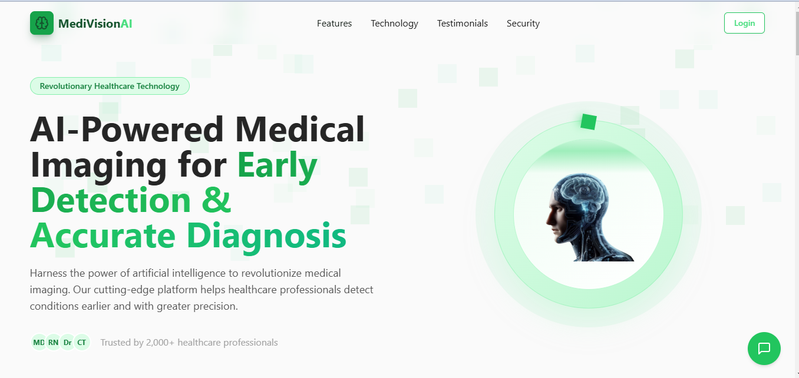
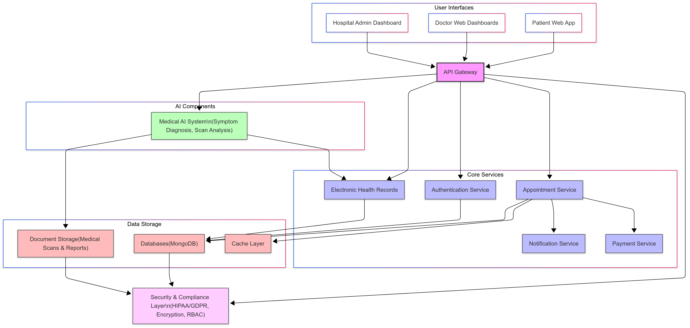

# **MediVisionAI**  
🚀 **AI-Powered Healthcare Revolution**  

MediVisionAI is a next-gen AI-powered healthcare platform that bridges the gap between **patients, doctors, and hospitals** by providing:  
✅ **Doctor & hospital recommendations**  
✅ **AI-driven symptom & scan analysis**  
✅ **Health tracking & medical history management**  
✅ **Seamless appointment booking**  
✅ **AI-powered doctor assistant for diagnosis support**  

---

## 📸 **Project Overview**  
  
> *AI-powered platform for preliminary diagnosis, doctor recommendations, and medical history tracking.*  

---

## 🎯 **Key Features**  
### 1️⃣ **AI Symptom Diagnosis**  
- Enter symptoms and get **AI-generated condition predictions** with **confidence scores**.  
- Get **doctor recommendations** based on AI-detected conditions.  
- AI-powered **chatbot for medical Q&A**.  

### 2️⃣ **AI Scan & Report Analysis**  
- Upload **X-rays, MRIs, or CT scans**, and get a **detailed AI-generated report**.  
- OCR-powered **document explanation** for complex medical reports.  
- Directly book **recommended specialists** based on the report.  

### 3️⃣ **Doctor & Hospital Search**  
- **Filter and sort doctors** based on **specialization, location, and availability**.  
- See **doctors affiliated with hospitals** before booking.  
- **Schedule virtual or in-person appointments** easily.  

### 4️⃣ **Health Tracker & Medical History**  
- Tracks **past symptoms, medical conditions, and prescribed medications**.  
- AI analyzes **recurring symptoms** and **suggests checkups**.  
- Automatically adds **appointment history** and **ongoing medications**.  

### 5️⃣ **Doctor Dashboard (MeditronAI)**  
- Manage **appointments, availability, and patient history**.  
- **AI-powered doctor assistant** for detailed condition explanations.  
- Send **pre-appointment tests** (e.g., CT Scan, MRI).  

### 6️⃣ **Hospital Admin Dashboard**  
- Manage **doctors, patient records, and appointments**.  
- View **hospital-wide analytics & reports**.  
- AI-powered **patient tracking system**.  

---

## 🎥 **Demo Videos**  
🎬 **[Patient Prototype Demo](./prototype/patient's_side.mp4)**  
🎬 **[Doctor Prototype Demo](./prototype/doctor's_side.mp4)**  

---

## 🔧 **Tech Stack**  
✅ **Frontend** – Next.js, TailwindCSS, shadcn/ui  
✅ **Backend** – Node.js, Express.js, Python (Flask)  
✅ **Database** – MongoDB  
✅ **AI Models** – Gemini 2.0, Meditron (LLM), OCR APIs  

---

## 📌 **User Flows**  
### **1️⃣ Patient Flow**  
✔️ **Login & Profile Setup**  
✔️ **Search Doctors & Book Appointments**  
✔️ **Upload Scans for AI Diagnosis**  
✔️ **Track Health & Medical History**  
✔️ **Receive Medication Reminders**  

### **2️⃣ Doctor Flow**  
✔️ **Login & Attach to Hospitals/Clinics**  
✔️ **View & Manage Appointments**  
✔️ **Send Pre-Appointment Tests**  
✔️ **Use AI for Diagnosis & Patient Analysis**  
✔️ **Update Post-Appointment Notes**  

### **3️⃣ Hospital Admin Flow**  
✔️ **Manage Doctor Listings & Appointments**  
✔️ **Monitor Patient Health Records**  
✔️ **AI-Driven Analytics & Insights**  

---

## 🖼 **System Architecture**  
  

---

## 🚀 **How to Set Up Locally**  
### **1️⃣ Clone the Repository**  
```bash
git clone https://github.com/lakshitaa-chellaramani/MediVisionAI.git
cd MediVisionAI
```

### **2️⃣ Install Dependencies**  
```bash
npm install
```

### **3️⃣ Start the Development Server**  
```bash
npm run dev
```

### **4️⃣ Run the Backend (Flask API)**  
```bash
cd backend
python app.py
```


## 📞 **Contact & Support**  
For any queries or issues, reach out via:  
📧 **Email** – lakshitaa2112@gmail.com , mohitmgokhale@gmail.com
---
